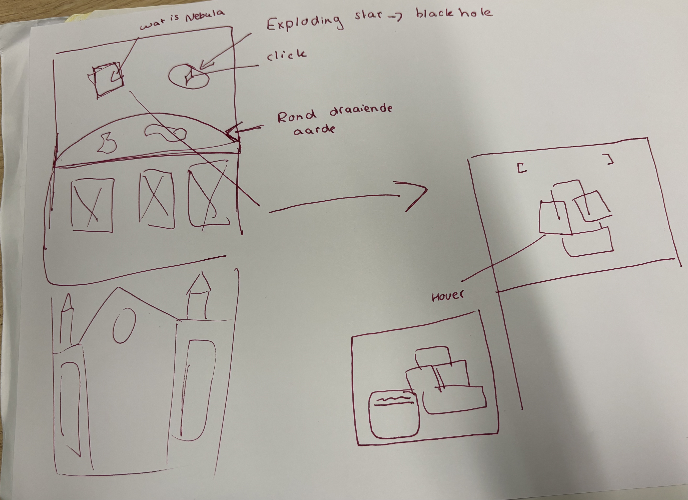
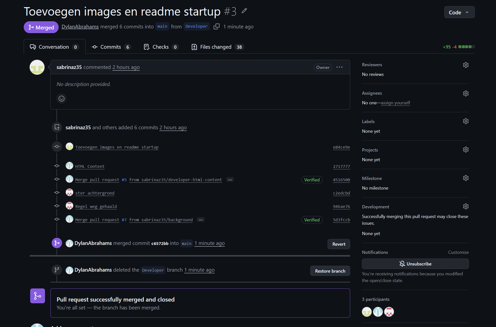
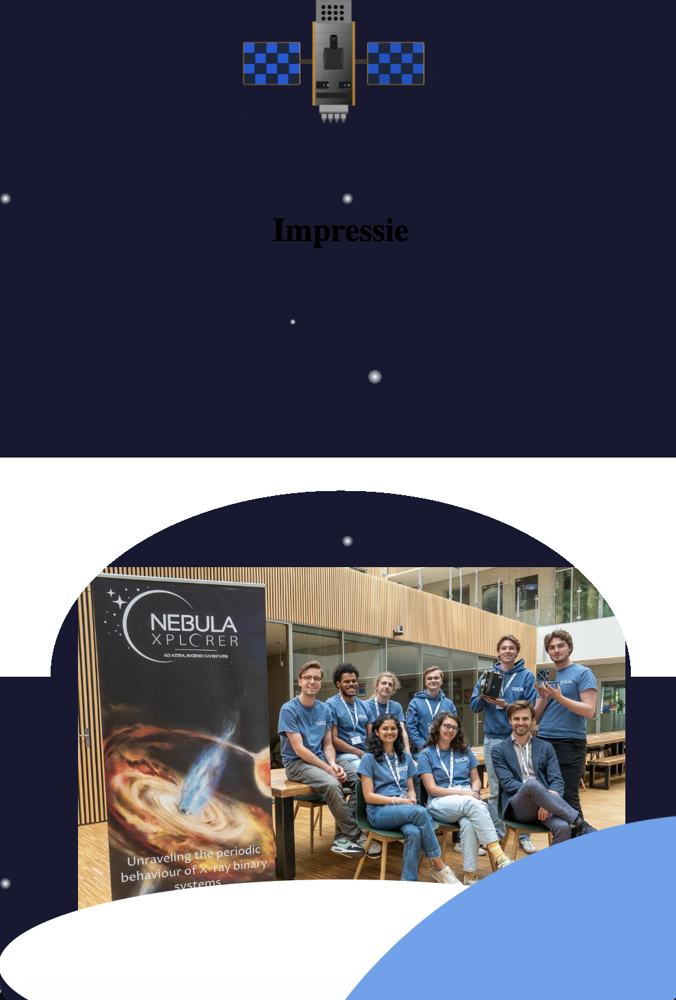
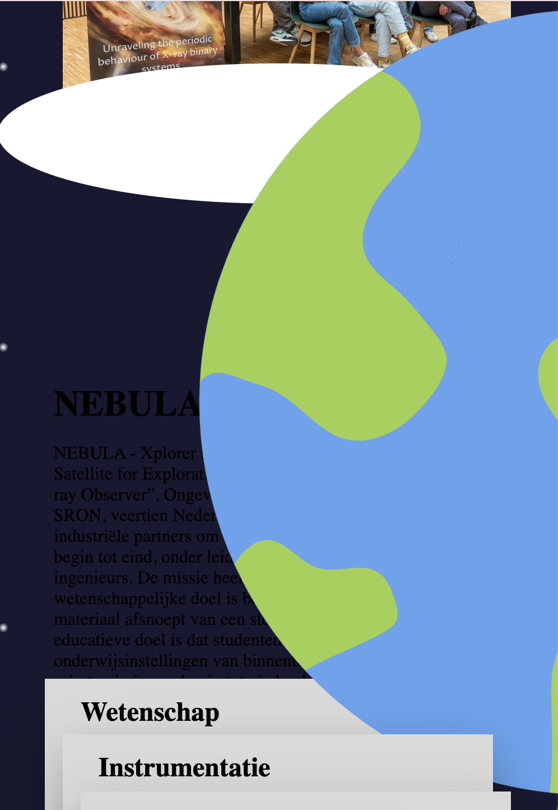
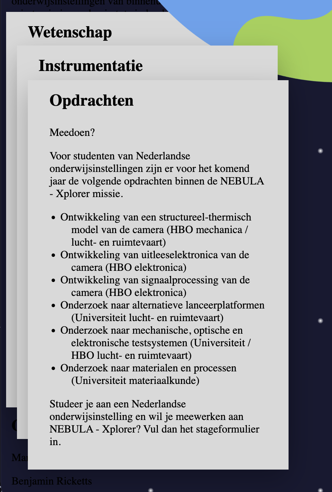
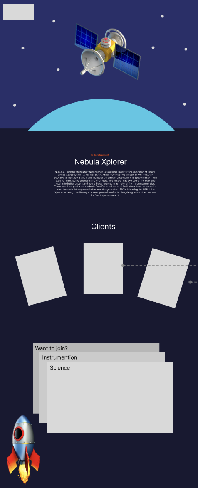

# Proces guardians-of-the-galaxy

## 🗓️ Maandag 23 maart 
### 💭 Ideeën bedenken
We willen ons gaan focussen op hoe de Nebula in elkaar zit en dit laten zien. Daarnaast willen wij de contributers bij dit project gezamenlijk met de missie van dit project een speciaal plekje geven.

Eerste schets gemaakt over een mogelijk idee met verschillende features.

Aantal ideeën:
- Een wereldbol maken wat ook ronddraait? Zodat de hero lijkt alsof je in de ruimte zit.
- De satalliet niet in 3D maken, maar 2D en gebruik maken van schaduwen om wel een 3D effect eraan te geven. 
- Een raket toevoegen dat als je onderin de pagina verder probeerd te scrollen dat die dan naar boven schiet
- Als je over de elementen van de satalliet heen hovert dat je dan meer informatie krijgt over dat element.
- Black hole - easter egg 😌

We hebben uiteindelijk al een start kunnen maken aan de site en hebben de taken verdeeld:
- Dylan die houdt zich bezig met de section informatie en heeft de html gevuld.
- Matthew houdt zich bezig met het maken van de nebula.
- Rafi houdt zich bezig met het maken van de achtergrond en de draaiende aardbol maken.
- Sabrina houdt zich bezig met de readme, en de section met impressie images en een algemene Figma opzet maken.

In het begin was het voor ieder van ons nog zoekende hoe het samenwerken gaat in Github. Waarbij we een developer branch hebben aangemaakt, maar deze ook binnen mum van tijd per ongeluk hadden verwijderd.

Uiteindelijk hebben we het volgende voor elkaar weten te krijgen.

## 🗓️ Maandag 24 maart 
### 🧱 Verder werken
We hebben een eerste opzet gemaakt via Figma om iedereen een duidelijk beeld te geven.

